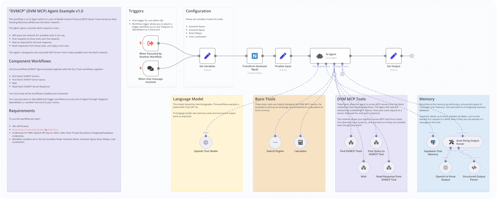

# n8n AI Agent for DVM MCP

These workflows create an AI Agent which is a user of Model Context Protocol (MCP) Server Tools served as Data Vending Machines (DVM) over the Nostr network –

The Agent, given a prompt which requires a tool –

- Will query the network for available tools it can use,
- Post requests to those tools over the network,
- Wait as required for the tool response,
- Read responses from those tools, and reply to the User.

Why this is interesting –

- For an LLM to use a MCP Tool, the MCP Server typically needs to reside upon the same system as the LLM,
- There has been no discovery methodology for an LLM to find MCP Severs and Tools which it does not yet have installed,
- Data Vending Machines allow LLMs to discover and use Tools over the Nostr network,
- This AI Agent Example demonstrates how an AI that can find and use MCP Tools that it does not have installed, by querying for them as DVMs over the Nostr network.

## Technologies

- **MCP**: The Model Context Protocol is an open protocol that allows AI agents to access data sources and tools. [Read more](https://github.com/modelcontextprotocol),
- **DVM**: Data Vending Machines listen for and respond to queries over the Nostr network. [Read more](https://github.com/nostr-protocol/nips/blob/master/90.md),
- **DVMCP**: Data Vending Machine Context Protocol bridges Model Context Protocol servers with Nostr's Data Vending Machine ecosystem. Any MCP server can serve any tool over the network, and any Agent client can access all tools served by any server. See [DVMCP by Gzuuus](https://github.com/gzuuus/dvmcp) and [NostrDVM by BelieveTheHype](https://github.com/believethehype/nostrdvm/tree/main),
- **n8n**: A low-code platform which is very convenient for creating Langchain Tools Agents. [Read more](https://docs.n8n.io/advanced-ai/).

## Prerequisites

- **n8n**: Install a self-hosted n8n on your system. You can follow the instructions from the [n8n website](https://docs.n8n.io/hosting/),
- **Nostrobots**: Install [Nostrobots Community Nodes](https://github.com/ocknamo/n8n-nodes-nostrobots/tree/main) by [Ocknamo](https://njump.me/npub1y6aja0kkc4fdvuxgqjcdv4fx0v7xv2epuqnddey2eyaxquznp9vq0tp75l) with instructions from the [n8n website](https://docs.n8n.io/integrations/community-nodes/installation/) which adds Nostr tools to your n8n isntance,
- **Add workflows from Github to n8n**: Add the five workflows to your n8n. 1. From Github copy the URL for the Raw .json ([example](https://github.com/r0d8lsh0p/n8n-AI-agent-DVM-MCP-client/raw/refs/heads/main/DVMCP_Agent_Example_v1_0.json)), 2. In n8n create a new workflow, then click "..." and "Import from URL",
- **Credentials**: Add the credentials for an OpenAI API (or other LLM), SerpAPI, Nostr Private Key (Nsec), Postgresql/Supabase,
- **Settings**: Workflow variables set in the Set Variables Node: Assistant Name, Assistant Npub, Nostr Relays, User Localisation.

If you do not have a Nostr private key, you can generate one at [NostrTool.com](https://nostrtool.com/).

### Component Workflows

The main workflow is DVMCP Agent Example v1.0.

Use this together with the four Tools Subworkflows –

- AI Tool – Find Nostr DVMCP Servers
- AI Tool – Post Nostr DVMCP Server Query
- AI Tool – Wait
- AI Tool – Read Nostr DVMCP Server Response
